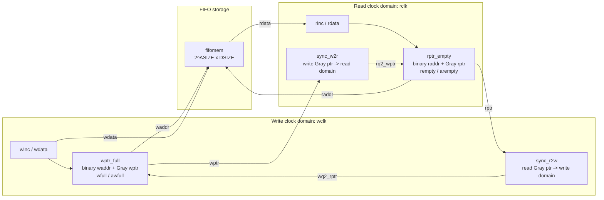

# Async FIFO 复现与协作开发指南

本文档记录本次复现 [`dpretet/async_fifo`](https://github.com/dpretet/async_fifo) 的完整思路、课程任务拆解、仓库结构、关键 RTL 分析、后续报告写作路线，以及上传到 GitHub 后的协作流程。

## 1. 课程任务结论

根据 `FinalProj.pdf` 和 `Final_Project_detailed_plan(1).pdf`，当前任务不是从零设计一个复杂芯片，而是选择一个开源 Verilog/RTL 项目，读懂它、复现它、分析它，并最终产出技术报告和课堂展示。

关键时间点：

- 技术报告 PDF 截止日期：2026-05-15。
- Presentation 日期：2026-04-30 和 2026-05-07。
- 展示时长：5-8 分钟。

评分和提交：

- Final Project 占课程总评 40%。
- Final Project Presentation 占课程总评 15%。
- STA report 是 bonus，不是必做项。
- 最终提交文件命名格式应为 `{student_id}_Name.pdf` 或 `{student_id}_Name.zip`，不符合命名规则会扣 5%。

报告必须覆盖的核心内容：

1. Project overview。
2. Build & simulation，可选但推荐。
3. Module diagram。
4. Interface description。
5. Micro-architecture。
6. Code walk-through。
7. Verification，可选。
8. Findings，要求 3-5 条具体观察。
9. References。

本仓库选择 Async FIFO，理由是它规模适中、模块边界清晰、CDC 主题有深度，非常适合在有限报告和 5-8 分钟 presentation 中讲清楚。

## 2. 本次本地执行记录

本次环境：

- 系统：WSL / Linux shell。
- 当前目录：`/mnt/c/Users/ASUS/Desktop/ics6204 project`。
- 图形界面：无。
- 测试策略：按任务要求，本次不执行 GUI 或仿真测试，只完成复现文档和协作文件整理。

已执行和确认的步骤：

1. 确认工作目录下已经存在 `async_fifo` 仓库副本。
2. 确认上游远程地址为 `https://github.com/dpretet/async_fifo`。
3. 执行 `git fetch origin`，确认本地 `master` 与 `origin/master` 指向相同提交。
4. 阅读两个 PDF 文档，确认课程要求、截止日期、报告结构和推荐选题。
5. 阅读上游 `README.md`、`doc/specification.rst`、`doc/testplan.rst`。
6. 阅读核心 RTL：`async_fifo.v`、`wptr_full.v`、`rptr_empty.v`、`sync_r2w.v`、`sync_w2r.v`、`fifomem.v`。
7. 阅读扩展 RTL：`async_bidir_fifo.v`、`async_bidir_ramif_fifo.v`。
8. 阅读验证和流程文件：`sim/async_fifo_unit_test.sv`、`sim/Makefile`、`flow.sh`、`.github/workflows/ci.yaml`、`syn/fifo.ys`。
9. 新增本复现项目文档：`guide.md`、`README.zh-CN.md`、`README.en.md`。
10. 新增 `.gitattributes`，降低 Windows/WSL 换行符导致的 Git 伪修改风险。
11. 更新根目录 `README.md`，加入本复现项目入口链接。
12. 完成本地 Git 提交：
    - `a09ab27 docs: add reproduction guide and bilingual readmes`
    - `d5c7f91 docs: link reproduction documentation from readme`
13. 添加远程 `xfdg = git@github.com:XFDG/async_fifo.git` 并尝试推送。
14. 推送失败，GitHub 返回 `ERROR: Repository not found.`；已确认 SSH 能认证到 `XFDG`，失败原因是 GitHub 上尚未创建 `XFDG/async_fifo` 仓库。

注意：工作区中原始文件可能显示大量 `M`，主要由 CRLF/LF 换行差异引起。判断时可使用：

```bash
git diff --ignore-cr-at-eol
git diff --numstat --ignore-cr-at-eol
```

如果这些命令没有实际输出，说明内容层面没有有效修改。不要随意执行 `git reset --hard`，除非你确认没有任何需要保留的本地修改。

## 3. 从零复现步骤

如果其他同学从空目录开始，可以按以下步骤复现。

### 3.1 安装基础工具

最低要求：

- Git。
- 文本编辑器，如 VS Code。
- Bash/WSL/Ubuntu shell。

可选工具：

- Verilator：用于 lint。
- Icarus Verilog：用于仿真。
- SVUT：原项目使用的 SystemVerilog unit test 工具。
- Yosys：用于逻辑综合。
- GTKWave：用于查看波形；本 WSL 无 GUI 时可跳过。

Ubuntu/WSL 可参考：

```bash
sudo apt update
sudo apt install -y git make iverilog verilator yosys
```

本次任务没有运行测试，因此这些工具不是当前文档交付的硬性前置条件。

### 3.2 克隆上游仓库

建议固定 LF 换行，避免 Windows/WSL 协作时出现全仓库伪修改：

```bash
git config --global core.autocrlf false
git clone https://github.com/dpretet/async_fifo.git
cd async_fifo
```

如果已经有本地仓库，更新上游即可：

```bash
cd async_fifo
git remote -v
git fetch origin
git status --short --branch
```

期望看到本地分支与 `origin/master` 对齐。

### 3.3 建议的阅读顺序

不要一开始逐行读所有文件。推荐顺序：

1. `README.md`：了解项目目标和已有说明。
2. `doc/specification.rst`：了解功能规格、复位要求和接口行为。
3. `rtl/async_fifo.v`：先抓顶层连接关系。
4. `rtl/wptr_full.v` 和 `rtl/rptr_empty.v`：理解指针、Gray code、满/空判断。
5. `rtl/sync_r2w.v` 和 `rtl/sync_w2r.v`：理解两级同步器。
6. `rtl/fifomem.v`：理解实际数据存储。
7. `sim/async_fifo_unit_test.sv`：了解已有测试覆盖了哪些场景。
8. `flow.sh`、`.github/workflows/ci.yaml`、`syn/fifo.ys`：了解工程化流程。

### 3.4 仓库目录说明

```text
async_fifo
├── .github/workflows/ci.yaml       # 上游 GitHub Actions：lint、simulation、synthesis
├── doc/
│   ├── specification.rst           # 功能规格
│   └── testplan.rst                # 测试计划
├── rtl/
│   ├── async_fifo.v                # 基础异步 FIFO 顶层
│   ├── async_bidir_fifo.v          # 双向 FIFO，内部 RAM
│   ├── async_bidir_ramif_fifo.v    # 双向 FIFO，外部 RAM 接口
│   ├── async_fifo.list             # 基础 FIFO 文件列表
│   ├── fifomem.v                   # 基础 FIFO 存储器
│   ├── fifomem_dp.v                # 双端口存储器
│   ├── rptr_empty.v                # 读指针和 empty 判断
│   ├── sync_ptr.v                  # 通用两级同步器
│   ├── sync_r2w.v                  # 读指针同步到写域
│   ├── sync_w2r.v                  # 写指针同步到读域
│   └── wptr_full.v                 # 写指针和 full 判断
├── sim/
│   ├── async_fifo_unit_test.sv     # SVUT 单元测试
│   ├── files.f                     # 仿真文件列表
│   ├── Makefile                    # 测试入口
│   └── wave.gtkw                   # GTKWave 配置
├── syn/
│   ├── fifo.ys                     # Yosys 综合脚本
│   └── syn_asic.sh                 # 综合执行脚本
├── flow.sh                         # lint/sim/syn 统一命令入口
├── README.zh-CN.md                 # 本复现项目中文说明
├── README.en.md                    # 本复现项目英文说明
└── guide.md                        # 本指南
```

## 4. 核心设计说明

### 4.1 Async FIFO 解决的问题

同步 FIFO 只有一个时钟，读写指针都在同一时钟域中更新。Async FIFO 的难点在于写端和读端属于不同 clock domain：

- 写端根据 `wclk` 写入数据。
- 读端根据 `rclk` 读出数据。
- 两端频率、相位都可能不同。
- 写端需要知道读指针位置，避免覆盖未读数据。
- 读端需要知道写指针位置，避免读取不存在的数据。

直接跨域传递多 bit 二进制指针是不安全的，因为多个 bit 可能同时变化，接收时钟域可能采样到过渡态。该项目使用 Gray code 指针跨域，因为相邻 Gray code 只有 1 bit 改变，可降低错误采样组合的风险。

### 4.2 顶层模块图

基础 FIFO 的结构可以用 Mermaid 表示：



报告中可以用 draw.io、PowerPoint、Mermaid 或手绘图重画这个结构。若最终报告要导出 PDF，建议使用 draw.io 或 PPT 画图，更易控制版式。

### 4.3 `async_fifo.v`

`rtl/async_fifo.v` 是基础顶层，实例化：

- `sync_r2w`：读指针同步到写域。
- `sync_w2r`：写指针同步到读域。
- `wptr_full`：写指针和 full 判断。
- `fifomem`：FIFO 存储阵列。
- `rptr_empty`：读指针和 empty 判断。

它的参数：

| 参数 | 默认值 | 说明 |
| --- | --- | --- |
| `DSIZE` | `8` | 数据位宽 |
| `ASIZE` | `4` | 地址位宽，深度为 `2**ASIZE` |
| `FALLTHROUGH` | `"TRUE"` | 首字直通，降低读端首次读延迟 |

它的端口：

| 信号 | 方向 | 时钟域 | 说明 |
| --- | --- | --- | --- |
| `wclk` | input | write | 写时钟 |
| `wrst_n` | input | write | 写侧低有效复位 |
| `winc` | input | write | 写请求，高有效 |
| `wdata` | input | write | 写入数据 |
| `wfull` | output | write | FIFO 满标志 |
| `awfull` | output | write | FIFO 将满标志 |
| `rclk` | input | read | 读时钟 |
| `rrst_n` | input | read | 读侧低有效复位 |
| `rinc` | input | read | 读请求，高有效 |
| `rdata` | output | read | 读出数据 |
| `rempty` | output | read | FIFO 空标志 |
| `arempty` | output | read | FIFO 将空标志 |

### 4.4 `wptr_full.v`

该模块工作在写时钟域，负责：

- 保存写端二进制指针 `wbin`。
- 输出写地址 `waddr = wbin[ADDRSIZE-1:0]`。
- 将下一个二进制指针转换为 Gray code，输出 `wptr`。
- 使用同步后的读指针 `wq2_rptr` 判断 `wfull`。
- 提前一拍判断 `awfull`。

写指针更新条件：

```verilog
assign wbinnext = wbin + ((winc & ~wfull) ? 1 : 0);
assign wgraynext = (wbinnext >> 1) ^ wbinnext;
```

满判断核心：

```verilog
assign wfull_val =
    (wgraynext == {~wq2_rptr[ADDRSIZE:ADDRSIZE-1], wq2_rptr[ADDRSIZE-2:0]});
```

含义是：当写指针追上读指针并绕回一圈时，FIFO 满。Gray 指针高两位取反、低位相等是经典异步 FIFO full 判断方式。

### 4.5 `rptr_empty.v`

该模块工作在读时钟域，负责：

- 保存读端二进制指针 `rbin`。
- 输出读地址 `raddr = rbin[ADDRSIZE-1:0]`。
- 将下一个二进制读指针转换为 Gray code，输出 `rptr`。
- 使用同步后的写指针 `rq2_wptr` 判断 `rempty`。
- 提前一拍判断 `arempty`。

读指针更新条件：

```verilog
assign rbinnext = rbin + ((rinc & ~rempty) ? 1 : 0);
assign rgraynext = (rbinnext >> 1) ^ rbinnext;
```

空判断核心：

```verilog
assign rempty_val = (rgraynext == rq2_wptr);
```

含义是：当下一读指针等于同步后的写指针时，读侧认为 FIFO 为空。

### 4.6 `sync_r2w.v` 和 `sync_w2r.v`

这两个模块都是两级寄存器同步器：

- `sync_r2w` 把读指针 `rptr` 同步到写域，输出 `wq2_rptr`。
- `sync_w2r` 把写指针 `wptr` 同步到读域，输出 `rq2_wptr`。

两级同步器不能消灭亚稳态，但可以显著降低亚稳态传播到后级逻辑的概率。因为跨域的是 Gray code 指针，即使同步采样发生在边沿附近，也只涉及单 bit 变化，风险比二进制多 bit 指针小。

### 4.7 `fifomem.v`

该模块是 FIFO 的数据存储：

```verilog
localparam DEPTH = 1 << ADDRSIZE;
reg [DATASIZE-1:0] mem [0:DEPTH-1];
```

写侧逻辑：

```verilog
always @(posedge wclk) begin
    if (wclken && !wfull)
        mem[waddr] <= wdata;
end
```

读侧根据 `FALLTHROUGH` 有两种模式：

- `"TRUE"`：`assign rdata = mem[raddr];`，首字直通，延迟更低。
- 非 `"TRUE"`：在 `rclk` 上寄存读数据，时序更规整。

### 4.8 双向 FIFO 扩展

`async_bidir_fifo.v` 和 `async_bidir_ramif_fifo.v` 扩展了基础 FIFO：

- `async_bidir_fifo.v`：A/B 两侧都可以读写，内部使用 `fifomem_dp`。
- `async_bidir_ramif_fifo.v`：保留指针、同步和控制逻辑，但把 RAM 接口暴露给外部。

报告主线建议聚焦 `async_fifo.v`，双向版本可以作为扩展设计说明，不要让 presentation 过度发散。

## 5. 可选验证和测试说明

本次没有运行测试，原因是当前任务明确说明 WSL 无图形界面，可以不用测试。需要注意的是，原项目的主要仿真不一定依赖 GUI，未来如果工具链完整，仍建议至少跑一次命令行仿真。

### 5.1 Lint

```bash
./flow.sh lint
```

作用：

- 调用 Verilator。
- 检查 `async_fifo` 及其基础子模块。
- 若 `lint.log` 中没有有效 `%Error:`，脚本认为 lint 成功。

### 5.2 Simulation

```bash
./flow.sh sim
```

作用：

- 进入 `sim/`。
- 使用 SVUT 和 Icarus Verilog 跑 `async_fifo_unit_test.sv`。
- `script/setup.sh` 会在找不到 `svutRun` 时尝试克隆 SVUT 到本地脚本目录。

已有测试覆盖：

- idle 状态下 `wfull == 0`、`rempty == 1`。
- 单次写入后读出。
- 多次连续写入后按顺序读出。
- full flag。
- empty flag。
- almost-empty flag。
- almost-full flag。
- 并发读写。

### 5.3 Synthesis

```bash
./flow.sh syn
```

作用：

- 进入 `syn/`。
- 调用 `syn/syn_asic.sh`。
- 使用 Yosys 执行 `fifo.ys`。
- 生成 `async_fifo_syn.v`。

课程 PDF 中 STA 是 bonus。若时间紧，不建议把 STA 放在主路径；如果后续要做，应先保证基础报告和 presentation 完成。

## 6. 报告写作模板

下面是建议直接用于技术报告的结构。

### 6.1 Project overview

可写内容：

- Async FIFO 是跨时钟域数据缓冲器。
- 适用于 producer 和 consumer 频率不同、相位未知或完全异步的系统。
- 典型场景包括总线桥接、数据采集、串并转换接口、SoC 子系统跨域通信。
- 本设计支持参数化数据宽度 `DSIZE` 和深度 `2**ASIZE`。
- 设计提供 `full`、`empty`、`almost full`、`almost empty` 状态标志。

### 6.2 Build & simulation

由于本次 WSL 环境不做测试，报告中可以诚实写：

- 原项目提供 Verilator lint、Icarus Verilog + SVUT 仿真、Yosys 综合脚本。
- 本次复现阶段重点为代码阅读和结构分析，没有执行 GUI 波形验证。
- 后续具备工具链时可运行 `./flow.sh lint`、`./flow.sh sim`、`./flow.sh syn`。

如果后续实际跑通，再补充 pass log 和关键截图。

### 6.3 Module diagram

报告中必须有图。建议至少画一张基础 `async_fifo` 的模块图：

- 左侧写时钟域：`winc`、`wdata`、`wptr_full`、`sync_r2w`。
- 中间 FIFO memory：`fifomem`。
- 右侧读时钟域：`rptr_empty`、`sync_w2r`、`rinc`、`rdata`。
- 标出 `wptr` 从写域跨到读域，`rptr` 从读域跨到写域。
- 标出跨域指针是 Gray code。

### 6.4 Interface description

建议分成写端和读端：

写端：

- `wclk`：写时钟。
- `wrst_n`：写域复位。
- `winc`：写请求。
- `wdata`：写数据。
- `wfull`：满标志，满时不应继续写。
- `awfull`：将满标志，可用于提前背压。

读端：

- `rclk`：读时钟。
- `rrst_n`：读域复位。
- `rinc`：读请求。
- `rdata`：读数据。
- `rempty`：空标志，空时不应继续读。
- `arempty`：将空标志，可用于提前停止读。

### 6.5 Micro-architecture

建议按数据路径和控制路径拆开写。

数据路径：

- 写端接收 `wdata`。
- `wptr_full` 产生 `waddr`。
- `fifomem` 在 `wclk` 上写入 `mem[waddr]`。
- `rptr_empty` 产生 `raddr`。
- `fifomem` 根据 `raddr` 输出 `rdata`。

控制路径：

- 写域维护 `wbin` 和 `wptr`。
- 读域维护 `rbin` 和 `rptr`。
- `wptr` 以 Gray code 形式通过 `sync_w2r` 到读域。
- `rptr` 以 Gray code 形式通过 `sync_r2w` 到写域。
- 写域根据同步后的读指针判断 full。
- 读域根据同步后的写指针判断 empty。

### 6.6 Code walk-through

建议不要逐行解释，而是按文件职责写：

- `async_fifo.v`：顶层连接。
- `wptr_full.v`：写指针、写地址、满判断。
- `rptr_empty.v`：读指针、读地址、空判断。
- `sync_r2w.v` / `sync_w2r.v`：跨域指针同步。
- `fifomem.v`：数据存储和 fall-through 读模式。
- `async_bidir_fifo.v`：双向扩展。
- `sim/async_fifo_unit_test.sv`：现有验证用例。

### 6.7 Verification

如果不跑测试，可以写成“现有验证计划分析”：

- 原项目测试计划考虑写时钟快于读时钟、慢于读时钟、相近频率等情况。
- 单元测试覆盖基础写读、连续写读、满/空标志、almost 标志和并发读写。
- 当前缺口包括更大随机压力、更系统的覆盖率统计、形式验证、复位异步释放场景等。

### 6.8 Findings

报告可以选择 3-5 条，要求具体。

可选 findings：

1. 设计采用 Gray code 指针跨域，这是异步 FIFO 的经典可靠做法，比直接同步二进制指针更安全。
2. full 和 empty 判断分别放在写域和读域，避免了跨域组合逻辑，结构清晰。
3. 两级同步器设计简单，但同步延迟会导致 full/empty 状态具有保守性，这是 CDC 设计中常见且合理的取舍。
4. `FALLTHROUGH` 参数提供低延迟读数据路径，但不同 FPGA/ASIC memory 推断方式可能不同，综合时需要检查目标工艺结果。
5. 双向 FIFO 文件中的部分注释与 `dir` 信号含义需要仔细核对，报告中可以作为代码可读性改进点提出。

### 6.9 References

建议引用：

- Upstream repository: https://github.com/dpretet/async_fifo
- Clifford Cummings, “Simulation and Synthesis Techniques for Asynchronous FIFO Design”.
- Course Final Project PDF。
- Upstream `doc/specification.rst` and `doc/testplan.rst`。

## 7. Presentation 建议

5-8 分钟不要讲太散，建议 7 页左右：

1. 题目页：Async FIFO Reproduction and Analysis。
2. 背景页：为什么需要跨时钟域 FIFO。
3. 顶层结构页：模块图。
4. 核心机制页：Gray code pointer + two-flop synchronizer。
5. full/empty 判断页：写域 full、读域 empty。
6. 代码 walkthrough 页：关键文件职责。
7. Findings 和总结页：3-5 条观察。

时间分配：

- 背景和用途：1 分钟。
- 模块结构：1.5 分钟。
- 微架构核心：2-3 分钟。
- 代码和验证：1 分钟。
- findings：1 分钟。

不要把 presentation 做成逐行代码朗读。重点是让听众看懂结构和设计取舍。

## 8. GitHub 发布和协作流程

目标是把复现仓库发布到 `https://github.com/XFDG` 下作为公开仓库。建议仓库名使用：

```text
async_fifo
```

如果这个名字已被占用，可以使用：

```text
async-fifo-reproduction
```

### 8.1 创建 GitHub 仓库

方式 A：网页创建。

1. 打开 https://github.com/new。
2. Owner 选择 `XFDG`。
3. Repository name 填 `async_fifo`。
4. Visibility 选择 Public。
5. 不要勾选 Initialize this repository with README。
6. 不要添加 `.gitignore`。
7. 不要添加 license，因为本地仓库已经有上游许可证。
8. 点击 Create repository。

方式 B：GitHub CLI。

如果安装并登录了 `gh`：

```bash
gh auth status
gh repo create XFDG/async_fifo \
  --public \
  --description "Reproduction and technical analysis of dpretet/async_fifo for ICS6204/MCE5913 final project" \
  --source=. \
  --remote=xfdg \
  --push
```

当前环境没有检测到 `gh` 命令，但 SSH 已能认证到 `XFDG`。因此如果网页先创建好仓库，本地可直接用 SSH 推送。

### 8.2 设置远程仓库

推荐保留上游 `dpretet/async_fifo`，并额外添加自己的 GitHub remote：

```bash
git remote -v
git remote rename origin upstream
git remote add origin git@github.com:XFDG/async_fifo.git
git remote -v
```

如果不想重命名，也可以保留 `origin` 指向上游，新增 `xfdg`：

```bash
git remote add xfdg git@github.com:XFDG/async_fifo.git
```

建议协作时采用第一种：`upstream` 表示原作者仓库，`origin` 表示团队自己的仓库。

### 8.3 首次推送

仓库创建后执行：

```bash
git status --short
git add .gitattributes guide.md README.zh-CN.md README.en.md
git commit -m "docs: add reproduction guide and bilingual readmes"
git push -u origin master
```

如果你使用的是 `xfdg` remote：

```bash
git push -u xfdg master
```

如果出现：

```text
ERROR: Repository not found.
```

通常说明 GitHub 上还没有创建该仓库，或者当前 SSH key 没有访问权限。

### 8.4 推荐分支策略

主分支：

- `master` 或 `main`：稳定版本，能代表当前报告/展示可用状态。

功能分支：

- `docs/report-outline`：报告大纲。
- `docs/module-diagram`：模块图和图示。
- `analysis/micro-architecture`：微架构分析。
- `analysis/findings`：findings 整理。
- `verification/sim-notes`：仿真和测试记录。

创建分支：

```bash
git checkout -b docs/report-outline
```

提交：

```bash
git add <files>
git commit -m "docs: add final report outline"
git push -u origin docs/report-outline
```

### 8.5 Pull Request 流程

建议所有协作者都通过 PR 合入：

1. 从最新 `master` 创建分支。
2. 在分支上修改文档、图或分析。
3. 本地检查 Markdown。
4. push 到 GitHub。
5. 创建 Pull Request。
6. 至少一名同学 review。
7. 解决评论后合并。

PR 描述建议包括：

```markdown
## Summary
- Added/updated ...

## Scope
- Report section:
- RTL files referenced:
- Diagrams affected:

## Checks
- [ ] Markdown reviewed
- [ ] Links checked
- [ ] No unrelated RTL changes
```

### 8.6 Issue 协作建议

可以在 GitHub Issues 中拆任务：

- `report: project overview`
- `diagram: async_fifo top-level module graph`
- `analysis: Gray code pointer and full/empty logic`
- `analysis: code walk-through`
- `slides: 5-8 min presentation`
- `verification: optional sim/lint notes`

每个 issue 写清楚：

- 目标是什么。
- 输出文件是什么。
- 参考哪些 RTL 文件。
- 截止时间。

### 8.7 与上游同步

如果原作者仓库后续更新：

```bash
git fetch upstream
git checkout master
git merge upstream/master
git push origin master
```

如果只想查看差异：

```bash
git fetch upstream
git log --oneline master..upstream/master
git diff master..upstream/master --stat
```

### 8.8 协作中的注意事项

- 不要把仿真生成的 `.vcd`、`.vvp`、`.out` 等文件提交。
- 不要无意修改 RTL 换行符后提交全仓库大 diff。
- 如果只写报告，尽量只改 Markdown、图片和文档。
- 如果修改 RTL，必须说明动机，并补充验证记录。
- 保留原作者 copyright 和 license。
- 中文报告和英文 README 可并存，但最终课程提交 PDF 应按课程命名规则导出。

## 9. 后续开发建议

短期优先级：

1. 用 `guide.md` 的报告模板写技术报告初稿。
2. 画 `async_fifo` 模块图。
3. 把 Gray code、同步器、full/empty 判断整理成 2-3 张 PPT 图。
4. 整理 3-5 条 findings。
5. 如果还有时间，再尝试命令行 lint/sim，不要把 STA 放在主路径。

建议新增的文档或素材：

- `doc/report_outline.zh-CN.md`：中文报告草稿。
- `doc/module_diagram.drawio`：模块图源文件。
- `doc/presentation_outline.zh-CN.md`：展示讲稿。
- `doc/findings.md`：观察和改进点。

## 10. 快速命令清单

克隆：

```bash
git clone https://github.com/dpretet/async_fifo.git
cd async_fifo
```

查看状态：

```bash
git status --short --branch
git remote -v
```

忽略 CRLF 干扰查看差异：

```bash
git diff --ignore-cr-at-eol
git diff --numstat --ignore-cr-at-eol
```

可选验证：

```bash
./flow.sh lint
./flow.sh sim
./flow.sh syn
```

添加自己的 GitHub remote：

```bash
git remote rename origin upstream
git remote add origin git@github.com:XFDG/async_fifo.git
```

提交本复现文档：

```bash
git add .gitattributes guide.md README.zh-CN.md README.en.md
git commit -m "docs: add reproduction guide and bilingual readmes"
```

推送：

```bash
git push -u origin master
```
